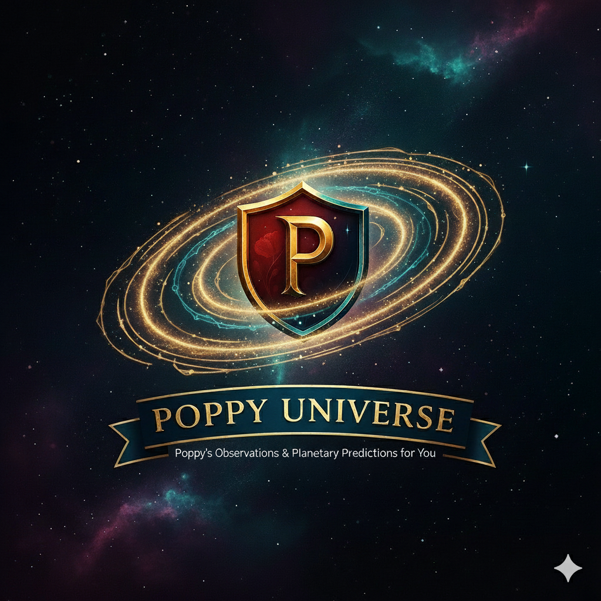

<div style="display: flex; align-items: center; gap: 10px;">
  <h1>Poppy Universe - Machine Learning</h1>
</div>

> **Simulated datasets, MF & NN predictions, ready for the engine via FastAPI**

This repository contains the **Machine Learning service** for the **Poppy Universe** project, hosted as a Dockerized API on Hugging Face Spaces. It processes user interaction data to provide meaningful insights and predictions for the recommendation engine.

---

## 🚀 API Gateway (FastAPI)

This Space acts as a production API. The following endpoints are available to trigger the ML pipeline from a Node.js backend:

* **`GET /`**: Health check to verify the service is online.
* **`POST /run-layer/2`**: Triggers the Trend Model (Object Liking Scores).
* **`POST /run-layer/3`**: Triggers the Matrix Factorization Master File.
* **`POST /run-layer/4`**: Triggers the Neural Network Master File.

---

## 🏗️ Layer Explanations

### 🌓 Layer 2 — Object Liking Scores
Aggregates interactions (views, clicks, favorites) to compute a **total liking score** per object.
- **Returns:** CSV with object-level scores: `trending_score`, `num_favorites`, etc.

### 🚀 Layer 3 — Matrix Factorization
Category-level prediction using MF to extract latent features from User × Category matrices.
- **Focus:** Semantic patterns across star types, planet types, and moon parents.

### 🌠 Layer 4 — Neural Network
A from-scratch neural network capturing nonlinear patterns between users and celestial categories using tanh activations and backpropagation.

---

## 📂 Project Structure

```tree
.
├── main.py              # FastAPI Application Gateway
├── Dockerfile           # Docker configuration for Hugging Face
├── requirements.txt      # Python dependencies
├── Data_Prep/           # Notebooks to create simulated datasets
├── Input_Data/          # Raw & simulated datasets (CSV)
├── Models/              # Python Master Scripts and Notebooks
│   ├── Layer2/
│   ├── Layer3/
│   ├── Layer4/
│   └── Plots/           # Visualizations (LFS Tracked)
├── Output_Data/         # Prediction outputs for the engine
└── Files/               # Temporary processing files
```

## 🏗️ Layer Explanations

### 🌓 Layer 2 — Object Liking Scores

> Layer 2 simulates **user interactions** and calculates a **liking score per object**.  
> These scores can be used as input for Layer 3 MF and Layer 4 NN models.

- **Inputs used:** 
  - Output from layer 1 
  - Simulated user interactions (views, clicks, favorites)  
  - Object types: Moons, planets, stars  

- **How it works:**  
  1. Aggregates interactions per user × object.  
  2. Computes a **total liking score** combining views, clicks, favorites.  
  3. Normalizes scores to create a consistent input for ML models.

- **Returns:**  
  - CSV with object-level scores: `Object_Type,Object_ID,total_interactions,num_views,num_clicks,num_favorites,trending_score`  

- **Note:**  
  - Rules are **hardcoded for simulation**.  
  - Once enough real data exists, these can be replaced with actual interactions.

### 🚀 Layer 3 — Matrix Factorization

> Layer 3 is the **category-level prediction layer using MF**.  
> Focuses on **semantic patterns** across categories (star types, planet types, moon parents).

- **Inputs used:**  
  - Ouptput from layer 1  
  - User × category matrices for stars, planets, moons  

- **How it works:**  
  1. Builds **User × Category matrices** (rows = users, columns = categories).  
  2. Fills missing interactions with 0, optionally normalizes.  
  3. Performs **matrix factorization** to extract latent features.  
  4. Predicts missing interactions, producing **user × category scores**.

- **Returns:**  
  - CSV with predicted scores: `User_ID,A,B,F,G,K,M,O,Dwarf Planet,Gas Giant,Ice Giant,Terrestrial,Earth,...`  
  - Used to rank categories for each user or as input for Layer 4.

- **Notes:**  
  - Simulated input is regenerated each run to get slightly different data.  
  - Hardcoded rules apply for now; real data can replace it once validated.

### 🌠 Layer 4 — Neural Network

> Layer 4 refines predictions using a **from-scratch neural network**.  
> Captures **nonlinear patterns** and interactions between users and categories.

- **Inputs used:**  
  - Output from layer 1
  - Simulated or real user × category data  
  - One-hot encoding for users and categories  
  - Interaction strength as target labels  

- **How it works:**  
  1. Encodes inputs for the NN.  
  2. Forward pass computes predicted scores through hidden layers with **tanh activations**.  
  3. Loss calculation against actual interaction strengths.  
  4. Backpropagation updates weights and biases with gradient descent.  
  5. Trains for multiple epochs; mini-batches optional.  
  6. Produces predicted scores for all user × category combinations.

- **Returns:**  
  - Refined **user × category predictions**  
  - CSV output for integration with the recommendation engine

- **Notes:**  
  - NN input is **simulated each run** for variety.  
  - Hardcoded rules currently define initial inputs; can be replaced with real interactions once verified.

---

## ⚙️ Usage Notes

* Simulated data allows testing MF and NN pipelines **before real user data exists**.  
* Each notebook can be run standalone for testing, or as part of the **ML workflow for the engine**.  
* Master notebooks (Layer3_Master & Layer4_Master) check if enough real data exists; otherwise, they default to simulated datasets.

---

## 🌠 Outputs

* **Object-level liking scores** (Layer 2)  
* **Predicted category-level scores** (Layer 3 MF)  
* **Refined category predictions** (Layer 4 NN)  
* All outputs saved as **CSV files** in `Output_Data/` for engine integration.

---

## 🌟 Future Plans

* Add **Business Logic** (Layer 5).
* Fully integrate with backend, frontend, and ML modules.
* Turn this into the **complete Poppy Universe project repo**, containing engine, frontend, backend, data, and ML.

---

## 🛠 Author

**Jelle Smet**


<p align="center">
  
</p>